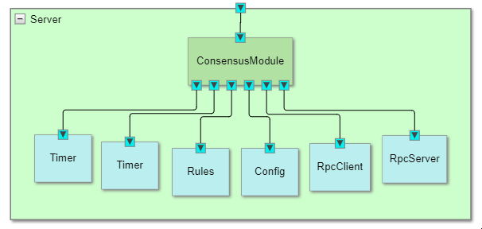

# Architecture of the Dezyne model

The following SystemView (generated using the Dezyne IDE) gives an overview of our Dezyne model.

In what follows we will describe each component of the model.

## Server

The Server component represents what we wanted to model: a Server that implements the Raft consensus protocol.
The Server component is our system component. It contains all other components and their interconnections.

A Server Cluster can be build using multiple instances of this Server. 
The Raft protocol takes care of synchronizing all Servers in the cluster.
The Servers in the Cluster elect a leader. The other Servers will follow the leader.

Clients can request the whole Cluster to execute a command. They must send a request (ClientRequest) to the Server that is the (elected) leader of the Cluster. 
The leader will take care of replicating the requested command to its followers.

Raft is based on the concept of consensus, i.e. all decisions in the Cluster (in particular "leader election" and "data replication") are supposed to be committed when a majority of the Servers agree. 
Therefor a Cluster must contain an odd number of Servers. 

## ConsensusModule

The ConsensusModule is the central component of a Server. It manages the state of the Server. To this end it communicates to its peers using the Raft protocol.

The Server can be OffLine or Online. When OnLine it can be in one of three Raft states:
- Follower
- Candidate
- Leader

Initially all Servers in the Cluster start in the Follower state and each start an election timer (with a random timeout).

When the election timer times out without a message from the Leader, a Follower assumes there is no leader, switches to the Candidate state and starts an election procedure to get enough votes to become the new leader.
Its sends a message (RequestVote) to all its peers to ask for their votes. When a majority of votes is received the Candidate becomes the Leader.

A Leader is responsible for receiving, logging and replication Client commands to its Followers. It has a heartbeat timer set to a much smaller time interval then the election timer. 
Each heartbeat timeout it will send updates (AppendEntries) to its Followers to both confirm its leadership and to replicate client commands.

For all messages received from Clients or its peer Servers it will consult the Rules component.

## Rules

The Raft protocol contains a lot of rules to guarantee that:
1. The Servers in the Cluster maintain a consistent state.
2. Commands from Clients are logged and executed by all Servers in the same sequence as requested.

The Rules component maintains a log of Client requested commands. 
The log and some important variables have to be regularly committed on permanent storage. They have to be reloaded when the Server boots.

The detailed Raft rules and the command log are not well suited for specification using Dezyne. They have to be implemented using handcrafted code.

## Timer

The Timer component contains a straightforward timer. Timeouts are be specified in milliseconds.

As described above two timers are used in Raft:
- election timer
- heartbeat timer

## RpcClient and RpcServer

Each Raft Server both requires and provides Remote Procedure Calls (RPCs).
Therefor each server has a RpcClient component to issue RPC requests and a RpcServer component to service RPC requests.

The Raft protocol uses a very small set of Remote Procedure Calls:
- *ClientRequest*, used by a Client to send requests to the Leader
- *AppendEntries*, used by a Leader to replicate Client commands to its Followers and to confirm its leadership
- *RequestVote*, used by a Candidate to request votes from other Servers in order to become the new Leader

Each of these RPCs has both a positive and a negative reply message.

## Config

The Config component is a simple configuration database, used to specify various parameters.

