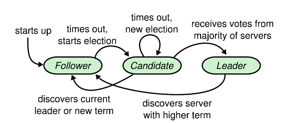

# raft-dezyne-model

This repository contains a [Dezyne](https://www.verum.com/dezyne/) model of the Raft consensus algorithm.

[Consensus](https://en.wikipedia.org/wiki/Consensus_(computer_science)) is a fundamental problem in distributed computing and multi-agent systems. 
Objective of consensus algorithms is to achieve overall system reliability in the presence of a number of faulty processes. 
Consensus algorithms allow a collection of machines to work as a coherent group that can survive the failures of some of its members.

[Raft](https://raft.github.io) is a proven and reasonably understandable consensus algorithm, used in modern cloud server clusters. 
It is an implementation of the [state machine replication](https://en.wikipedia.org/wiki/State_machine_replication) concept.

The Dezyne model in this repository is based on the paper [In Search of an Understandable Consensus Algorithm (Extended Version)](https://raft.github.io/raft.pdf) by Diego Ongaro and John Ousterhout.

The Raft algorithm decomposes consensus within a cluster of servers into three sub-problems:

1. **Leader Election**:
A leader is elected by majority vote among the servers in the cluster. 
In case the leader fails automatically a new leader is elected.
The algorithm takes care that in each term (virtual time period) there can only be one leader.
The other servers in the cluster follow the leader's orders.

2. Log replication:
The leader receives commands from clients, logs them and replicates them to the followers. 
When a log entry is replicated to a majority of servers, it is supposed to be committed. 
The command will then be executed and its result is returned to the client.

3. Guarding Consistency:
The rules of the algorithm take care that commands are committed and executed by all servers in the same sequence they have been requested.
If one of the servers has committed a log entry at a particular index, no other server can apply a different log entry for that index.
	
Each server can be in one of three states: leader, follower, or candidate. 
A leader leads the pack. A follower follows the leader. A candidate wants to become leader.

Time is divided in virtual time periods, called terms. In a term there can be at most one leader.
Each server maintains a currenTerm variable representing its view of time. 
The currentTerm is increased monotonically by a candidate each time it (re)starts a new leader election.

Initially all servers start as followers.
A follower that does not hear from a leader within a (randomly selected) election timeout period will become candidate.
A candidate will become leader when it has collected a majority of votes from other servers in the cluster.
A leader confirms its leadership using regular heartbeat messages and services the requests of clients.
A candidate or leader will step down and become follower when they hear (via messages they receive) from a leader of a higher term then their own.

Raft basically needs just three kind of Remote Procedure Calls (RPC's):
- ClientRequest RPC: used by clients to request the execution of a command
- RequestVote RPC: used candidates to collect votes to become leader
- AppendEntries RPC: used by the leader to replicate log entries and as heartbeat to confirm its leadership

